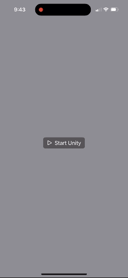

# unity-swiftui

This is a _reference project_ for those that want to use [Unity as a Library](https://unity.com/features/unity-as-a-library) in their SwiftUI iOS app. Unity's [existing iOS documentation](https://github.com/Unity-Technologies/uaal-example/blob/master/docs/ios.md) only demonstrates UAAL with UIKit/Objective-C projects and lacks illustrative examples of native-to-unity state flow, control of the Unity view, and automated integration of Unity's build output.



## Requirements

- Physical device with iOS 17.0 or later.
- Unity Editor 2022.3.42f1 - latest LTS as of Aug 13, 2024 - with iOS build support installed in Unity Hub.

## Instructions

1. **Clone repository**
    ```bash
    git clone https://github.com/bdeweygit/unity-swiftui.git
    cd unity-swiftui
    ```

2. **Create build folder for Unity project**
    ```bash
    mkdir -p UnityProject/Builds/iOS
    ```

3. **Open and build Unity project**
    - Use Unity Hub to open `UnityProject` directory.
    - Go to `File` > `Build Settings`.
    - In platform menu, select `iOS` and click `Switch Platform`.
    - Click `Build` and choose `Builds/iOS` folder you created earlier.

4. **Open integration workspace**
    - Use Xcode to open `integration.xcworkspace` file.

5. **Configure SwiftUI project**
    - Edit `UnitySwiftUI` target's signing settings with valid bundle identifier and signing team ID.
    - Switch to `UnitySwiftUI` scheme.

6. **Run on physical device**
    - Connect your device to Xcode.
    - Build and run `UnitySwiftUI` scheme to your device.

## Key features

- Control of Unity view as a SwiftUI element that can be repositioned and resized. Unity's [documentation](https://docs.unity3d.com/2022.3/Documentation/Manual/UnityasaLibrary-iOS.html) says "Unity as a Library only supports full-screen rendering, and doesn’t support rendering on part of the screen." We have fixed this limitation.
- Touches and gestures on Unity view are processed within Unity.
- Restarting the Unity player.
- State is sent from native Swift to Unity C# as a struct with members including string, boolean, floating point, integer, and MTLTexture types.

## Key files

### SwiftUI Project

- [**Unity.swift**](SwiftUIProject/UnitySwiftUI/Unity.swift): Class for controlling Unity framework and native-to-unity state flow.
- [**ContentView.swift**](SwiftUIProject/UnitySwiftUI/ContentView.swift): UI demonstrating Unity view as a SwiftUI element and controls for layout and state.

### Unity Project

- [**NativeStateManager.cs**](UnityProject/Assets/Scripts/NativeStateManager.cs): Class for receiving and storing native state.
- [**RootBehavior.cs**](UnityProject/Assets/Scripts/RootBehavior.cs): Script that renders sample scene - cube and spotlight - reacting to state updates and touch events.
- [**NativeState.h**](UnityProject/Assets/Plugins/iOS/NativeState.h), [**NativeState.m**](UnityProject/Assets/Plugins/iOS/NativeState.m): Plugin enabling flow of state from native Swift to Unity C#.
- [**UnityFramework.modulemap**](UnityProject/Assets/Plugins/iOS/UnityFramework.modulemap): Custom modulemap for plugin interoperability with Swift.
- [**PostProcessBuild.cs**](UnityProject/Assets/Editor/PostProcessBuild.cs): Script automating integration of Unity generated Xcode project.

If you want to adapt an existing project based on the [**Unity.swift**](SwiftUIProject/UnitySwiftUI/Unity.swift) file, you will likely need to disable Xcode's `Thread Performance Checker` under `Product` > `Scheme` > `Edit Scheme` > `Run` > `Diagnostics` > `Runtime API Checking`. The file has a comment explaining this.

## Known issues
- After building Unity project, Xcode workspace may not always reflect latest files and be unable to build. Close and reopen workspace to fix this.
- When running while attached to Xcode, there may be some noticeable delay between device orientation change and UI layout. There should be no such delay when running detached.
